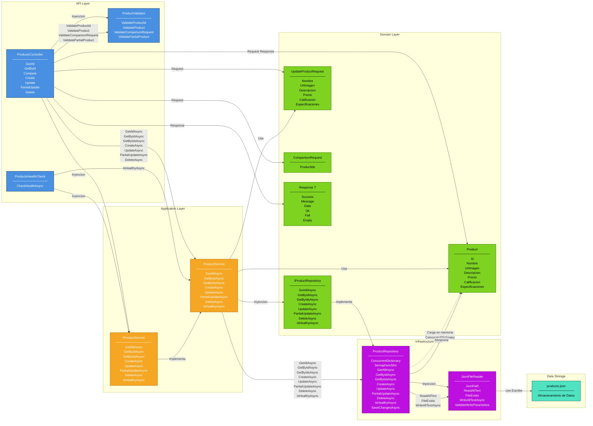

```mermaid
graph LR
    subgraph API["API Layer"]
        PC["ProductsController<br/>────────────────<br/>GetAll<br/>GetById<br/>Compare<br/>Create<br/>Update<br/>PartialUpdate<br/>Delete"]
        PV["ProductValidator<br/>────────────────<br/>ValidateProductId<br/>ValidateProduct<br/>ValidateComparisonRequest<br/>ValidatePartialProduct"]
        PHC["ProductsHealthCheck<br/>────────────────<br/>CheckHealthAsync"]
    end

    subgraph Application["Application Layer"]
        IPS["IProductService<br/>────────────────<br/>GetAllAsync<br/>GetByIdAsync<br/>GetByIdsAsync<br/>CreateAsync<br/>UpdateAsync<br/>PartialUpdateAsync<br/>DeleteAsync<br/>IsHealthyAsync"]
        PS["ProductService<br/>────────────────<br/>GetAllAsync<br/>GetByIdAsync<br/>GetByIdsAsync<br/>CreateAsync<br/>UpdateAsync<br/>PartialUpdateAsync<br/>DeleteAsync<br/>IsHealthyAsync"]
    end

    subgraph Infrastructure["Infrastructure Layer"]
        PR["ProductRepository<br/>────────────────<br/>ConcurrentDictionary<br/>SemaphoreSlim<br/>GetAllAsync<br/>GetByIdAsync<br/>GetByIdsAsync<br/>CreateAsync<br/>UpdateAsync<br/>PartialUpdateAsync<br/>DeleteAsync<br/>IsHealthyAsync<br/>SaveChangesAsync"]
        JFR["JsonFileReader<br/>────────────────<br/>JsonPath<br/>ReadAllText<br/>FileExists<br/>WriteAllTextAsync<br/>ValidateWriteParameters"]
    end

    subgraph Data["Data Storage"]
        PJ["products.json<br/>────────────────<br/>Almacenamiento de Datos"]
    end

    subgraph Domain["Domain Layer"]
        IPR["IProductRepository<br/>────────────────<br/>GetAllAsync<br/>GetByIdAsync<br/>GetByIdsAsync<br/>CreateAsync<br/>UpdateAsync<br/>PartialUpdateAsync<br/>DeleteAsync<br/>IsHealthyAsync"]
        PROD["Product<br/>────────────────<br/>Id<br/>Nombre<br/>UrlImagen<br/>Descripcion<br/>Precio<br/>Calificacion<br/>Especificaciones"]
        UPR["UpdateProductRequest<br/>────────────────<br/>Nombre<br/>UrlImagen<br/>Descripcion<br/>Precio<br/>Calificacion<br/>Especificaciones"]
        CR["ComparisonRequest<br/>────────────────<br/>ProductIds"]
        RESP["Response T<br/>────────────────<br/>Success<br/>Message<br/>Data<br/>Ok<br/>Fail<br/>Empty"]
    end

    PC -->|Inyeccion| PV
    PC -->|Inyeccion| IPS
    PC -->|ValidateProductId<br/>ValidateProduct<br/>ValidateComparisonRequest<br/>ValidatePartialProduct| PV
    PC -->|GetAllAsync<br/>GetByIdAsync<br/>GetByIdsAsync<br/>CreateAsync<br/>UpdateAsync<br/>PartialUpdateAsync<br/>DeleteAsync| PS

    PHC -->|Inyeccion| IPS
    PHC -->|IsHealthyAsync| PS

    IPS -->|implementa| PS

    PS -->|Inyeccion| IPR
    PS -->|GetAllAsync<br/>GetByIdAsync<br/>GetByIdsAsync<br/>CreateAsync<br/>UpdateAsync<br/>PartialUpdateAsync<br/>DeleteAsync<br/>IsHealthyAsync| PR

    IPR -->|implementa| PR

    PR -->|Inyeccion| JFR
    PR -->|ReadAllText<br/>FileExists<br/>WriteAllTextAsync| JFR

    JFR -->|Lee Escribe| PJ
    PR -.->|Carga en memoria<br/>ConcurrentDictionary| PROD

    PC -->|Request Response| PROD
    PC -->|Request| UPR
    PC -->|Request| CR
    PC -->|Response| RESP
    PS -->|Usa| PROD
    PS -->|Usa| UPR
    PR -->|Almacena| PROD

    classDef apiLayer fill:#4A90E2,stroke:#2E5C8A,color:#fff,stroke-width:2px
    classDef appLayer fill:#F5A623,stroke:#C67B1A,color:#fff,stroke-width:2px
    classDef infraLayer fill:#BD10E0,stroke:#8B0AA8,color:#fff,stroke-width:2px
    classDef dataLayer fill:#50E3C2,stroke:#2A8A78,color:#000,stroke-width:2px
    classDef domainLayer fill:#7ED321,stroke:#4F8C14,color:#000,stroke-width:2px

    class PC,PV,PHC apiLayer
    class IPS,PS appLayer
    class PR,JFR infraLayer
    class PJ dataLayer
    class IPR,PROD,UPR,CR,RESP domainLayer
```
