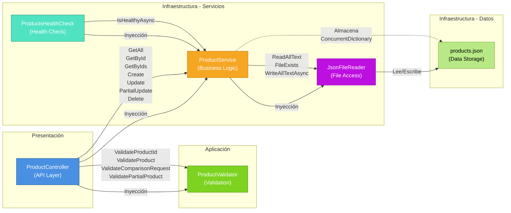

```mermaid
graph LR
    subgraph "Presentación"
        PC["ProductController<br/>(API Layer)"]
    end

    subgraph "Aplicación"
        PV["ProductValidator<br/>(Validation)"]
    end

    subgraph "Infraestructura - Servicios"
        PS["ProductService<br/>(Business Logic)"]
        JFR["JsonFileReader<br/>(File Access)"]
        PHC["ProductsHealthCheck<br/>(Health Check)"]
    end

    subgraph "Infraestructura - Datos"
        PJ["products.json<br/>(Data Storage)"]
    end

    PC -->|Inyección| PV
    PC -->|Inyección| PS
    PC -->|GetAll<br/>GetById<br/>GetByIds<br/>Create<br/>Update<br/>PartialUpdate<br/>Delete| PS
    PC -->|ValidateProductId<br/>ValidateProduct<br/>ValidateComparisonRequest<br/>ValidatePartialProduct| PV

    PS -->|Inyección| JFR
    PS -->|ReadAllText<br/>FileExists<br/>WriteAllTextAsync| JFR

    PHC -->|Inyección| PS
    PHC -->|IsHealthyAsync| PS

    JFR -->|Lee/Escribe| PJ

    PS -.->|Almacena<br/>ConcurrentDictionary| PJ

    style PC fill:#4A90E2,stroke:#2E5C8A,color:#fff
    style PV fill:#7ED321,stroke:#4F8C14,color:#fff
    style PS fill:#F5A623,stroke:#C67B1A,color:#fff
    style JFR fill:#BD10E0,stroke:#8B0AA8,color:#fff
    style PHC fill:#50E3C2,stroke:#2A8A78,color:#fff
    style PJ fill:#B8E986,stroke:#7BA324,color:#000
```
