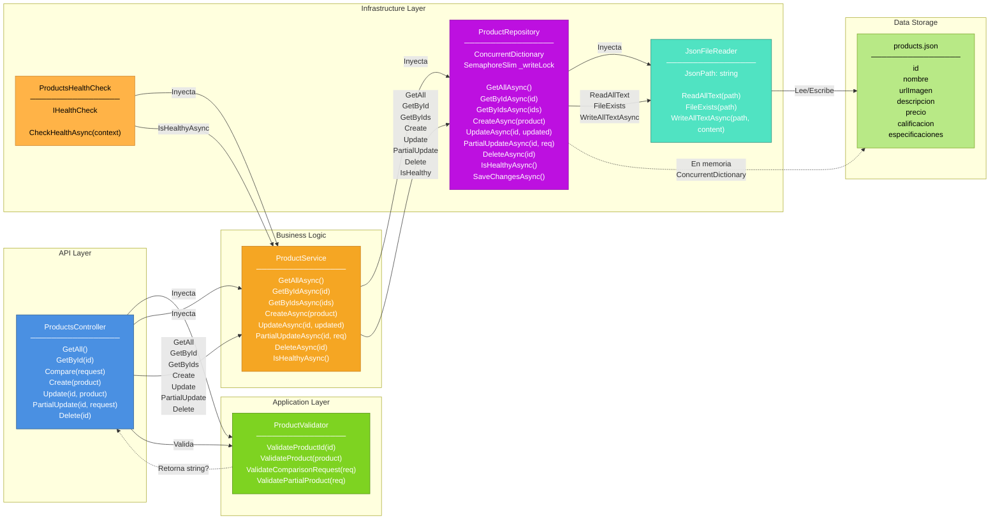

```mermaid
graph LR
    subgraph "API Layer"
        PC["ProductsController<br/>─────────────────<br/>GetAll()<br/>GetById(id)<br/>Compare(request)<br/>Create(product)<br/>Update(id, product)<br/>PartialUpdate(id, request)<br/>Delete(id)"]
    end

    subgraph "Application Layer"
        PV["ProductValidator<br/>─────────────────<br/>ValidateProductId(id)<br/>ValidateProduct(product)<br/>ValidateComparisonRequest(req)<br/>ValidatePartialProduct(req)"]
    end

    subgraph "Business Logic"
        PS["ProductService<br/>─────────────────<br/>GetAllAsync()<br/>GetByIdAsync(id)<br/>GetByIdsAsync(ids)<br/>CreateAsync(product)<br/>UpdateAsync(id, updated)<br/>PartialUpdateAsync(id, req)<br/>DeleteAsync(id)<br/>IsHealthyAsync()"]
    end

    subgraph "Infrastructure Layer"
        PR["ProductRepository<br/>─────────────────<br/>ConcurrentDictionary<br/>SemaphoreSlim _writeLock<br/><br/>GetAllAsync()<br/>GetByIdAsync(id)<br/>GetByIdsAsync(ids)<br/>CreateAsync(product)<br/>UpdateAsync(id, updated)<br/>PartialUpdateAsync(id, req)<br/>DeleteAsync(id)<br/>IsHealthyAsync()<br/>SaveChangesAsync()"]
        
        JFR["JsonFileReader<br/>─────────────────<br/>JsonPath: string<br/><br/>ReadAllText(path)<br/>FileExists(path)<br/>WriteAllTextAsync(path, content)"]
        
        PHC["ProductsHealthCheck<br/>─────────────────<br/>IHealthCheck<br/><br/>CheckHealthAsync(context)"]
    end

    subgraph "Data Storage"
        JSON["products.json<br/>─────────────────<br/>id<br/>nombre<br/>urlImagen<br/>descripcion<br/>precio<br/>calificacion<br/>especificaciones"]
    end

    PC -->|Inyecta| PV
    PC -->|Inyecta| PS
    PC -->|GetAll<br/>GetById<br/>GetByIds<br/>Create<br/>Update<br/>PartialUpdate<br/>Delete| PS
    PC -->|Valida| PV

    PV -.->|Retorna string?| PC

    PS -->|Inyecta| PR
    PS -->|GetAll<br/>GetById<br/>GetByIds<br/>Create<br/>Update<br/>PartialUpdate<br/>Delete<br/>IsHealthy| PR

    PHC -->|Inyecta| PS
    PHC -->|IsHealthyAsync| PS

    PR -->|Inyecta| JFR
    PR -->|ReadAllText<br/>FileExists<br/>WriteAllTextAsync| JFR
    PR -.->|En memoria<br/>ConcurrentDictionary| JSON

    JFR -->|Lee/Escribe| JSON

    style PC fill:#4A90E2,stroke:#2E5C8A,color:#fff
    style PV fill:#7ED321,stroke:#4F8C14,color:#fff
    style PS fill:#F5A623,stroke:#C67B1A,color:#fff
    style PR fill:#BD10E0,stroke:#8B0AA8,color:#fff
    style JFR fill:#50E3C2,stroke:#2A8A78,color:#fff
    style PHC fill:#FFB347,stroke:#CC8833,color:#000
    style JSON fill:#B8E986,stroke:#7BA324,color:#000
```
